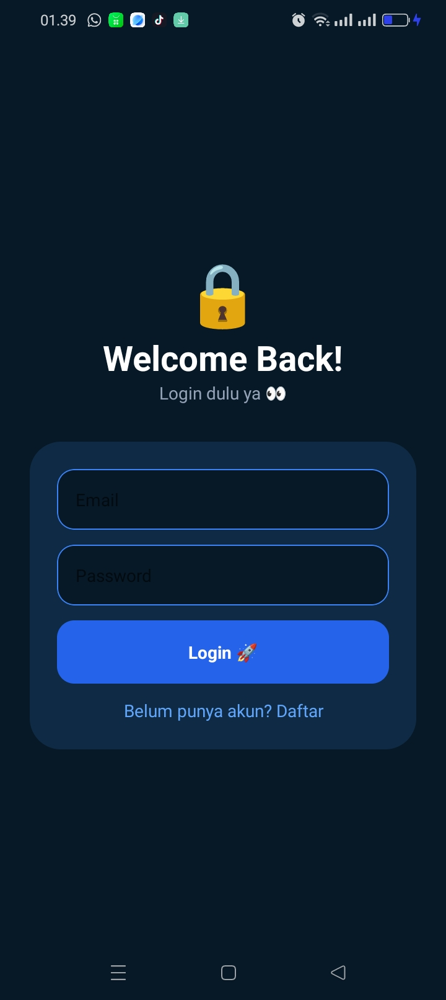
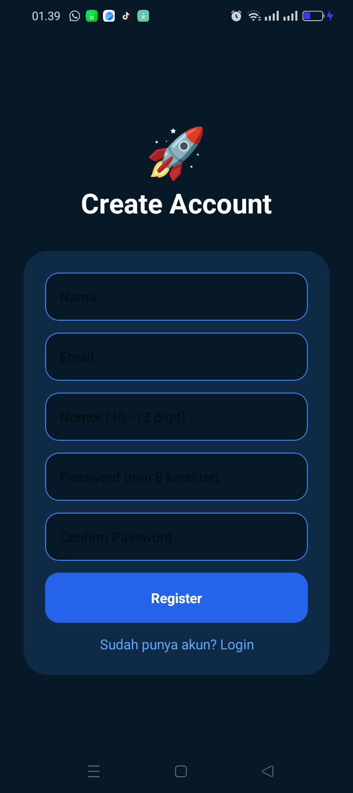
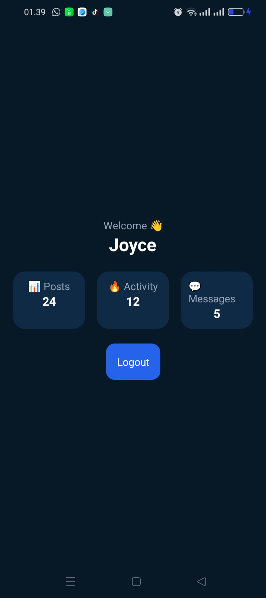

# 🛡️ Project M5: The Secure Guard ⚡

Tugas praktikum - Authentication (Login, Register, Home).

---

## 📸 Preview

### 🔐 Login Screen

### 📝 Register Screen

### 🏠 Home Screen

---

## 🛠️ Logic Implemented
- Validasi email menggunakan Regex
- Validasi nomor hanya angka (10–13 digit)
- Password minimal 8 karakter
- Confirm password harus sama
- Navigasi antar halaman (Login → Register → Home)
- Menampilkan nama user di halaman Home

---

## 🔗 Demo
[Cek di Expo Snack](https://snack.expo.dev/@joyyy21/the-secure-guard)
